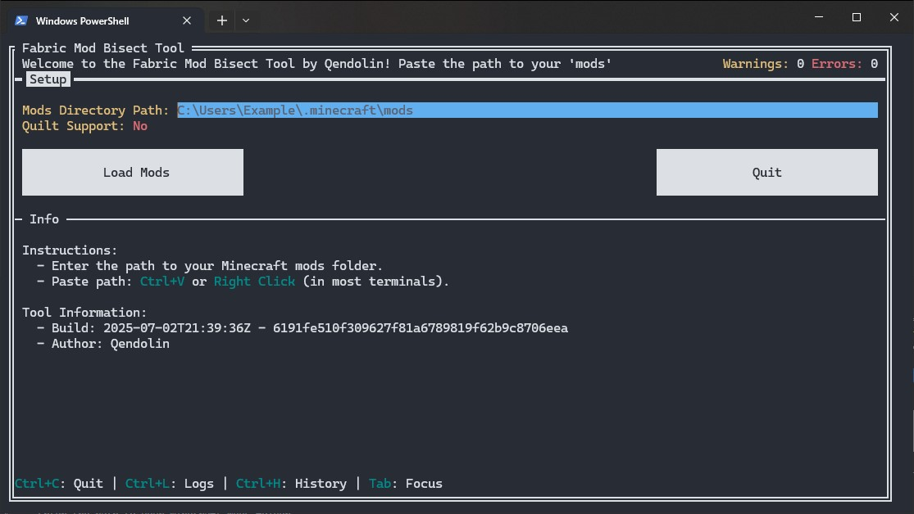
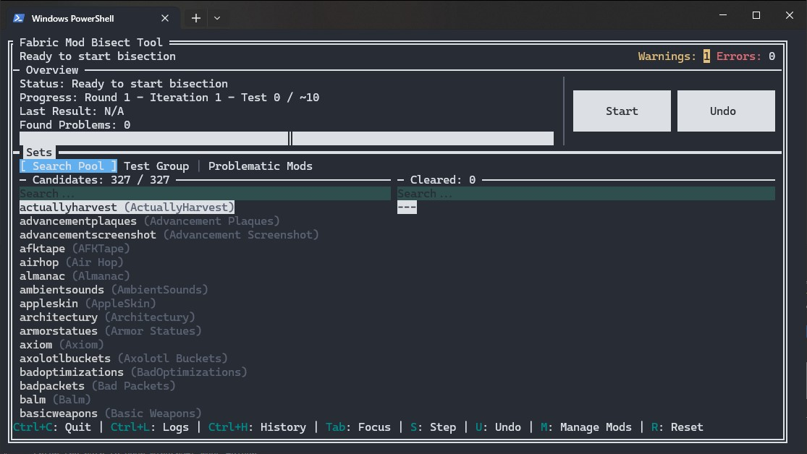
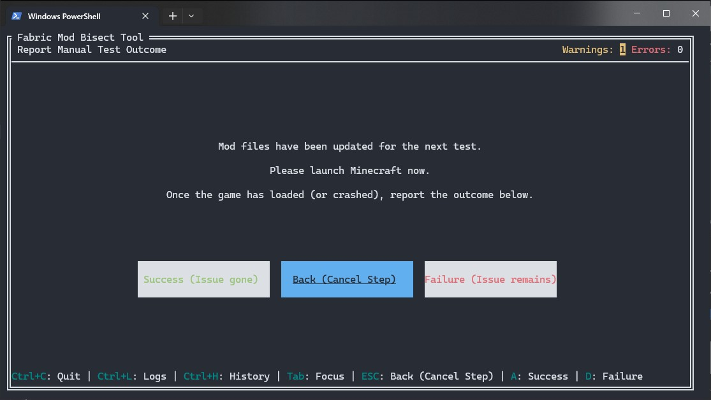
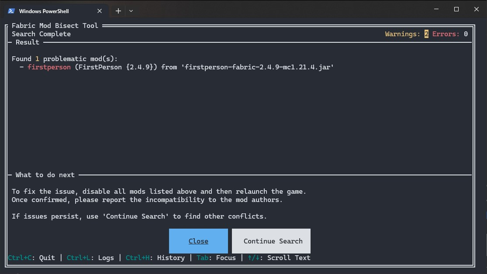
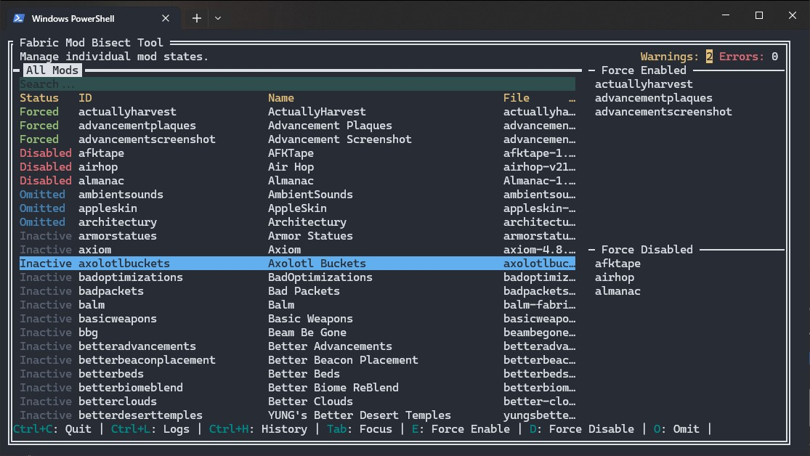
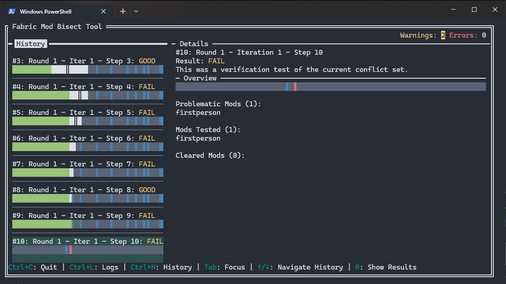

# Fabric Mod Bisect Tool

A powerful, easy-to-use tool to find conflicting Fabric and Quilt mods.

If your game is having issues, like crashing on startup or exhibiting strange bugs, and you have hundreds of mods, finding the culprit can be a nightmare. This tool automates that process by performing a guided search, quickly pinpointing exactly which mod or combination of mods is causing the failure.

> [!WARNING]
> ## When Should You Use This Tool?
> This tool is powerful, but it can be time-consuming. **Always check your crash report or game log first!** Often, the log will directly name the problematic mod.
>
> **Use this tool when:**
> * The crash report does not name a specific mod.
> * The game doesn't crash but has a subtle in-game bug.
> * You suspect a conflict between two or more mods that the logs don't show.

## How It Works

> [!IMPORTANT]
> Please read the following instructions carefully to effectively use the Fabric Mod Bisect Tool. Understanding these steps will help you quickly resolve your mod conflicts.

This tool is like a smart detective for your mods folder. Instead of you having to manually guess which mods to disable, it does the hard work for you through a methodical process.

1.  **Fast Search:** It performs a "bisection search" to quickly narrow down the list of potential troublemakers. It will ask you to launch the game with different sets of mods enabled, using your feedback to eliminate half of the remaining candidates in each step.
2.  **Pinpoints the Problem:** After a few steps, it will tell you exactly which mod or group of mods is causing the issue.
3.  **Finds Multiple Conflicts:** If you have more than one mod conflict, the tool is smart enough to find the first one, let you set it aside, and then **continue searching** the rest of your mods to find other, unrelated conflicts.

## Installation

1.  Go to the [Releases page](https://github.com/Qendolin/fabric-mod-bisect-tool/releases).
2.  Download the correct file for your system (do not download the `.md5` files).
    * **Windows:** `windows-amd64`
    * **Linux:** `linux-amd64`
    * **macOS (Apple Silicon):** `darwin-arm64`
3.  On Linux or macOS, you may need to make the file executable by running this command in your terminal:
    ```bash
    chmod +x ./your-downloaded-file-name
    ```
4.  Place the tool in a convenient location. You can run it from anywhere!

## How to Use the Tool

Using the tool is a simple, guided process.

### Step 1: Setup

When you first launch the tool, you'll see the setup screen.

#### Action

1. Enter or paste the full path to your Minecraft `mods` folder.
2. Press the **Load Mods** button.

The tool will then analyze all your mods, which may take a few moments.



### Step 2: The Main Screen

This is your mission control. You'll see several lists showing the status of your mods. The most important one is **"Candidates,"** which are the mods currently being tested.

#### Action

* Press the **"Start"** button (or the `S` key) to begin the first test.

> [!IMPORTANT]
> **Force-enable mods that are needed to see the problem.**  
> If the issue you're trying to track down only happens when a specific mod is active, you should **force enable** that mod.
>
> For example, if you're using Iris and something only breaks when shaders are turned on, you'll need to force-enable Iris. Otherwise, the tool might disable it during testing, and you wouldn't even be able to tell if the issue still happens.



### Step 3: The Test

The tool will now show you a "Test in Progress" screen. It has just enabled a specific set of mods in your folder.

#### Action

1.  Launch Minecraft using your normal mod loader (Fabric or Quilt).
2.  Check if the problem still occurs. Does the game crash? Does the bug you're hunting still happen?
3.  Return to the tool and click the button that matches the outcome:
  * **Success (No Issue):** The problem did *not* happen. The game loaded and worked as expected.
  * **Failure (Issue Occurred):** The problem *did* happen (e.g., the game crashed or the bug was present).

The tool will use your answer to narrow down the search and prepare the next test. Repeat this process until a result is found.



### Step 4: The Results

Once the tool has found a problematic mod (or set of mods), it will show you the **Result** screen.

#### Action

1.  Take note of the problematic mods listed.
2.  You should now manually disable or delete those specific mod files from your `mods` folder. The tool will also tell you if any other mods depend on the problematic ones; consider disabling them as well.
3.  If you suspect there might be other unrelated issues, you can return to the main page and click **"Continue Search"** to start looking for the next problem among the remaining mods.



## Managing Mods

On the main screen, you can press **`M`** to go to the **Manage Mods** page. This gives you fine-grained control over the search process.

* **Force Enabled:** The mod will be *always on* for every test. Use this for essential libraries or APIs (like Fabric API) that you are certain are not the problem.
* **Force Disabled:** The mod is treated as if it were temporarily removed from the `mods` folder. It will be *always off* and cannot be activated as a dependency for another mod.
* **Omitted:** The mod is ignored and removed from the search pool (`Candidates`). However, if another mod being tested requires it as a dependency, the tool **will still activate it**. This is useful for performance mods or libraries you've already confirmed are safe but are needed for other mods to run.
* **Pending:** A temporary status indicating a mod will be added back into the search pool at the start of the next full search round. This is a safety measure to ensure the integrity of an in-progress bisection.



> [!TIP]
> If you already have an idea of which mods might be causing trouble, you can speed up the search! Press `Shift+O` to set all mods to **Omitted**. Then, simply go through the list and toggle **Omitted** off (by pressing `O`) for only the mods you suspect are involved. This way, the tool will only search within that smaller group.

## History Page

You can press **`Ctrl+H`** to go to the **History** page. This page provides a detailed log of all the tests performed during the current bisection session. For each test, you'll see which mods were enabled and the outcome you reported (Success or Failure). This is useful for reviewing your steps, understanding how the tool arrived at its conclusion, or for debugging purposes if you believe there was an error in the process.



## Log Page

You can press **`Ctrl+L`** to go to the **Log** page. This page displays the internal log of the tool in real-time. It's primarily useful for debugging purposes or for providing information when reporting an issue to the developers. You can also find the full log file saved as `bisect-tool-YYY-MM-DD_HH-MM-SS.log` in the same directory as the executable.

## Advanced Features

### Command-Line Options

You can launch the tool with these optional flags for more control.

* `--no-embedded-overrides`: Disables the built-in list of fixes for mods that have known dependency issues. Use this if you think a built-in fix is causing problems.
* `--verbose`: Turns on detailed debug logging. The log file (`bisect-tool.log`) will contain much more information, which is useful for bug reports.
* `--quilt`: Enables special support for Quilt mods (e.g., reading `quilt.mod.json`).
* `--log-dir <path>`: Lets you specify a different folder to save the `bisect-tool.log` file. For example: `--log-dir "C:\my_logs"`.

### Dependency Overrides

Sometimes, a mod developer forgets to list a dependency in their metadata file. This tool can fix that using an override file. You can create a file named `fabric_loader_dependencies.json` to add or remove dependencies.

The tool loads these files in a specific priority order (1 takes precedence over 2, etc.):
1.  A file in the **same directory where you are running the tool**.
2.  A file in your Minecraft instance's `config` folder (e.g., `.minecraft/config/`).
3.  The tool's own built-in list of overrides for common mods.

This tool also extends the standard format with the ability to override the `provides` field, which is useful for fixing complex library conflicts.

## Capabilities: What This Tool Can Handle

This tool is built on a powerful dependency resolver and bisection engine, allowing it to handle even the most complex mod-related issues.

* **Automatic Dependency Activation:** You don't need to worry about enabling libraries or APIs yourself. When the tool tests a mod, it automatically enables all of its required dependencies. If `Mod A` needs `Fabric API`, the tool ensures both are active for the test.

* **Complex Conflict Scenarios:**
    * **Single-Mod Conflicts:** The simplest case where one mod causes an issue.
    * **Multi-Mod Conflicts:** The tool can find conflicts that only happen when two or more specific mods (`Mod A` + `Mod B`) are enabled at the same time.
    * **Dependency Conflicts:** It can correctly identify when a conflict is caused by a library (`API X`) that is automatically pulled in as a dependency by another mod.
    * **Nested JARs:** It correctly handles mods that bundle their libraries inside their own JAR file. If a bundled library is the problem, the tool will correctly point to the top-level mod as the cause.

* **Multiple, Unrelated Conflicts:** The "Continue Search" feature allows the tool to find all independent conflicts in your modpack. After finding the first conflict set, you can tell the tool to continue searching through the remaining mods to find other, completely separate problems.

* **Graceful Error Handling:** If you accidentally delete a mod file while a search is in progress, the tool will detect it, notify you, and allow you to continue the search without the missing mod, preventing crashes and preserving your progress.
