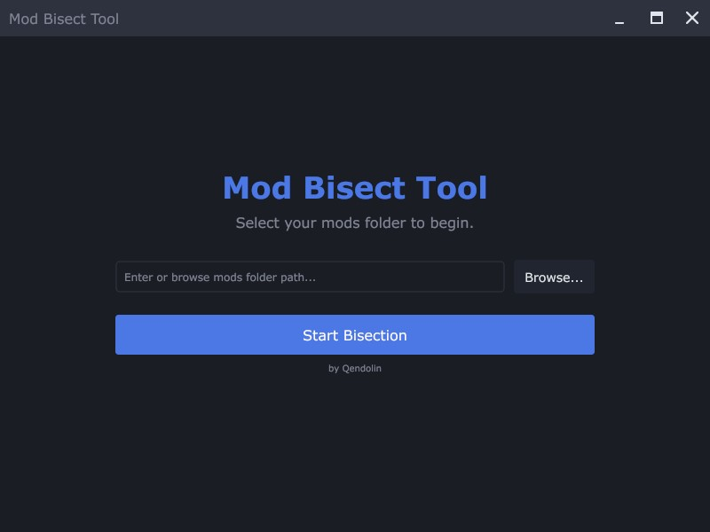
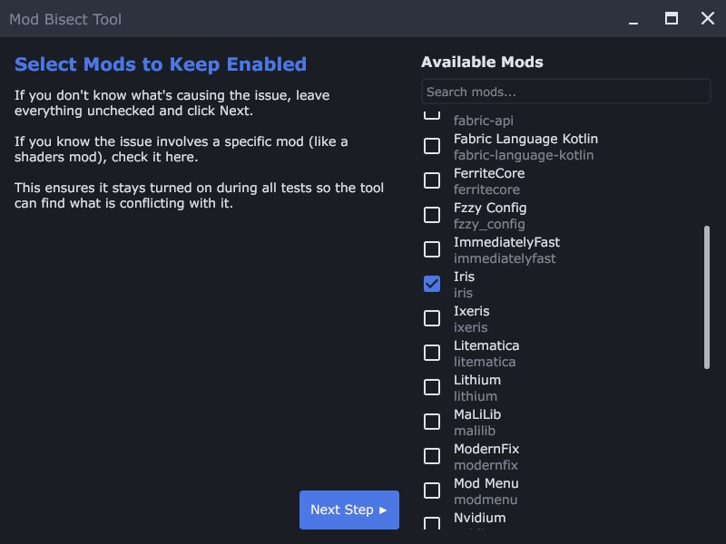
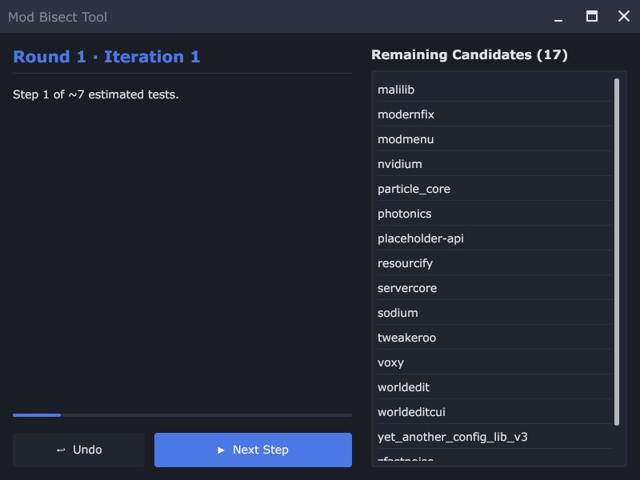
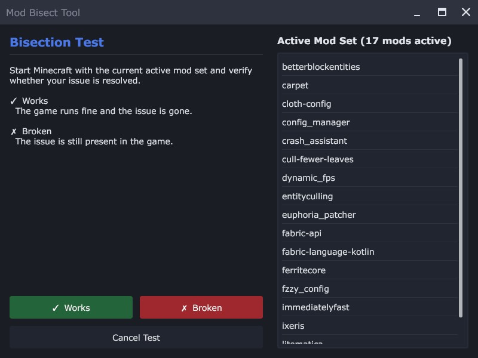
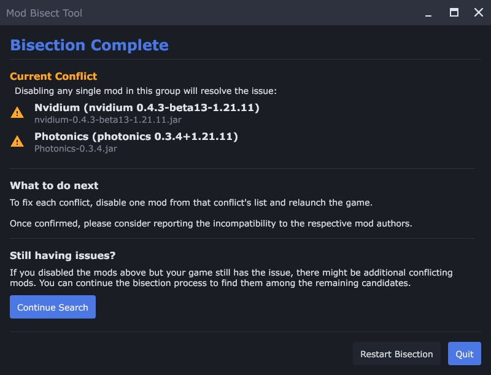

# GUI User Guide

This guide covers the **graphical** version of the Mod Bisect Tool. If you are
using the terminal version, see the [TUI User Guide](TUI-User-Guide.md).

The GUI follows the same bisection process as the TUI, but is driven by buttons,
a windowed interface, and native dialogs instead of keyboard shortcuts.

## How to Use the Tool

Using the tool is a simple, guided process.

### Step 1: Setup

When you first launch the tool, you'll see the setup screen.

#### Action

1. Enter the full path to your Minecraft `mods` folder in the text field, or click **Browse...** to pick it with your operating system's file picker.
2. Press the **Start Bisection** button.

The tool will then analyze all your mods, which may take a few moments. It also
checks the folder for Quilt and NeoForge mods and enables the matching support
automatically (you can still force them via the `--quilt` / `--neoforge` command
line flags).

### Step 2: Choose Mods to Keep Enabled

After the mods are loaded, you'll see a screen titled **"Select Mods to Keep Enabled."**

#### Action

* If you don't know what's causing the issue, leave everything unchecked and press **Next Step ▶**.
* If you know the issue involves a specific mod (like a shaders mod), check it here. This ensures it stays turned on during all tests so the tool can find what is conflicting with it.

You can use the **Search mods...** field to filter the list by mod name or ID.

> [!IMPORTANT]
> **Force-enable mods that are needed to see the problem.**  
> If the issue you're trying to track down only happens when a specific mod is active, you should **check** that mod here. For example, if you're using Iris and something only breaks when shaders are turned on, you'll need to keep Iris enabled. Otherwise, the tool might disable it during testing, and you wouldn't even be able to tell if the issue still happens.

### Step 3: The Main Screen

This is your mission control. It shows a progress bar, the current step, and a
list of the **remaining candidates** (or the current **conflict set** when a set
has been found).

#### Action

* Press the **▶ Start Bisection** button to begin the first test. On later steps the button reads **▶ Next Step**.
* You can also press **↩ Undo** to step back to a previous test.

### Step 4: The Test Screen

Once a test is prepared, the tool switches to a **test prompt** with the **Active Mod Set** listed. It has just enabled a specific set of mods in your folder.

#### Action

1.  Launch Minecraft using your normal mod loader (Fabric, Quilt or NeoForge).
2.  Check if the problem still occurs. Does the game crash? Does the bug you're hunting still happen?
3.  Return to the tool and click the button that matches the outcome:
  * **✓ Works:** The problem did *not* happen. The game loaded and worked as expected.
  * **✗ Broken:** The problem *did* happen (e.g., the game crashed or the bug was present).
  * **Cancel Test:** Aborts the current test and goes back.

> [!IMPORTANT]
> The tool will use your answer to narrow down the search and prepare the next test. **Repeat this process** until a result is found.

### Step 5: The Results

Once the tool has found a problematic mod (or set of mods), it will show you the **Result** screen.

#### Action

1.  Take note of the problematic mods listed.
2.  To fix the issue, disable **at least one** mod from each conflict set listed. The tool will also tell you if any other mods depend on the problematic ones; consider disabling them as well.
3.  The main button on this screen depends on whether the conflict set is complete:
  * **Next Step:** shown while the set is not yet complete. Pressing it goes back to the main screen to continue searching for the remaining members of the conflict set. You don't have to continue, though: a single mod is already enough to fix the issue.
  * **Quit:** shown once the set is complete. It closes the application.
4.  You can also use these buttons:
  * **Continue Search:** start looking for the next, unrelated conflict among the remaining mods.
  * **Restart Bisection:** begin the whole search over from scratch.

