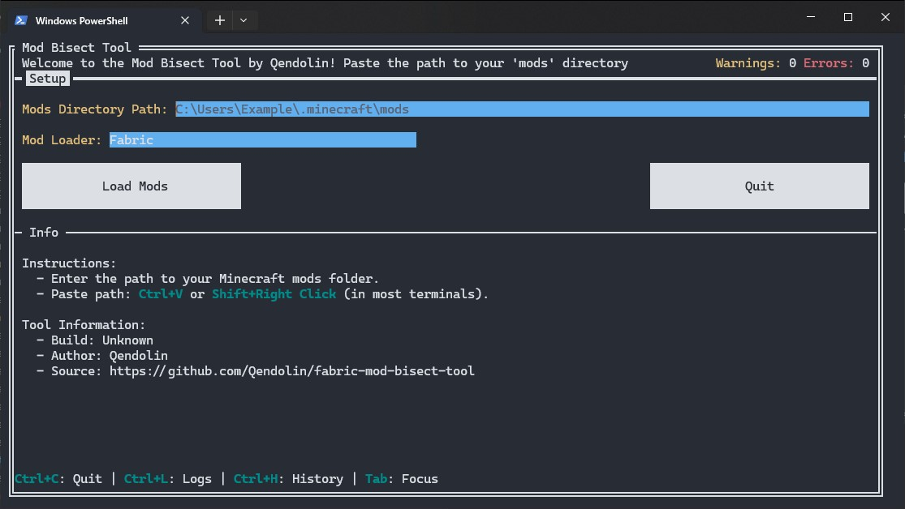
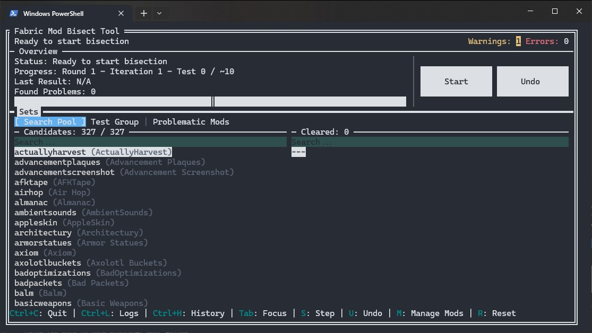
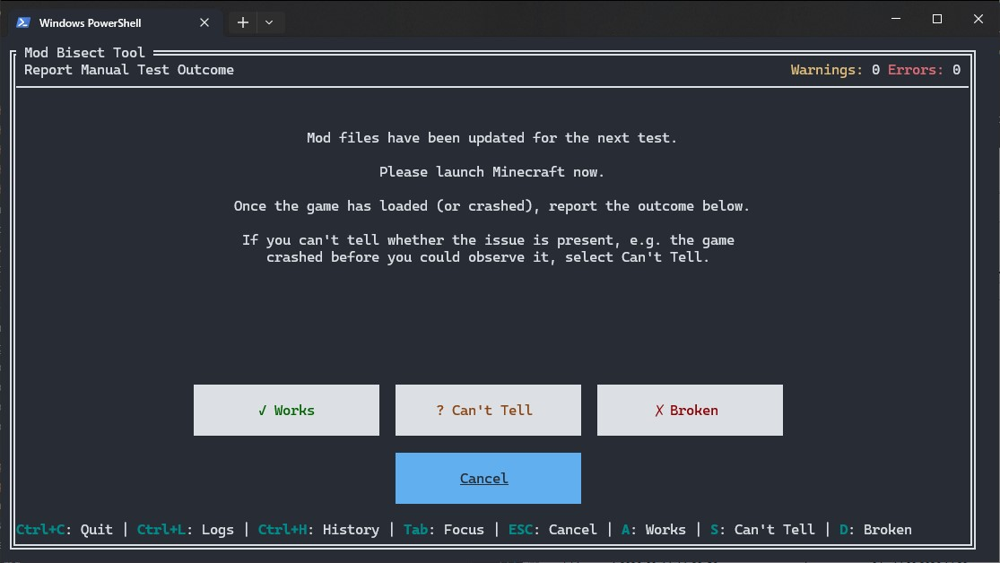
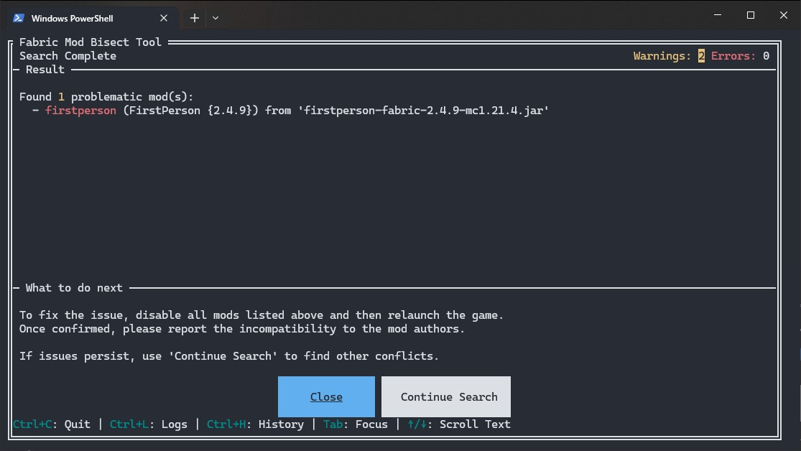
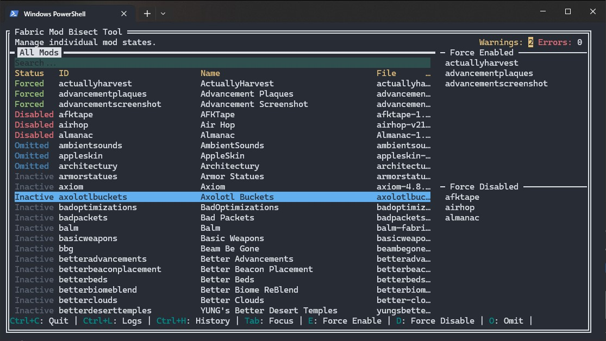
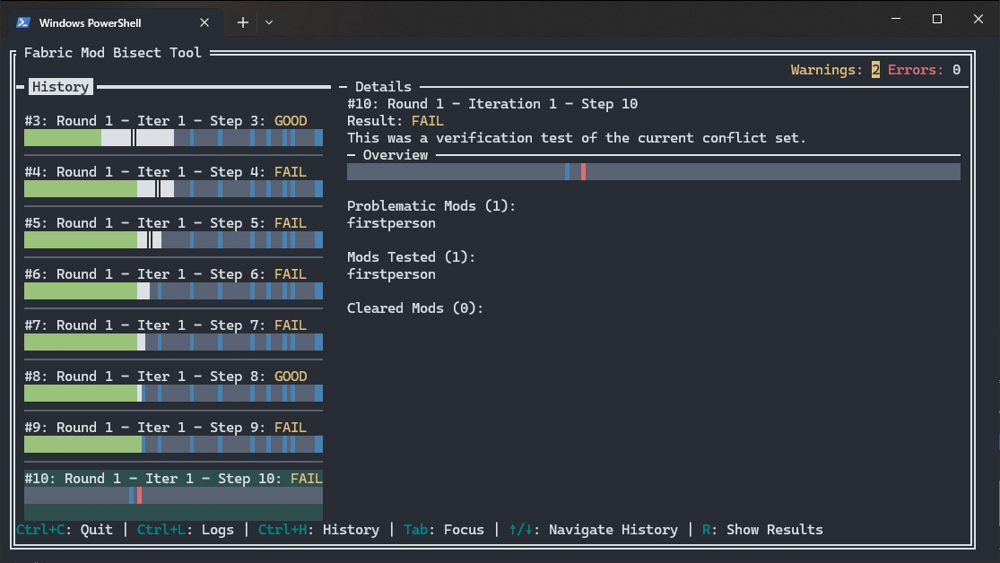

# TUI User Guide

This guide covers the **terminal (TUI)** version of the Mod Bisect Tool. If you
are using the graphical version, see the [GUI User Guide](GUI-User-Guide.md).

## Installation

1. Open the [releases page](https://github.com/Qendolin/fabric-mod-bisect-tool/releases).
2. Download the TUI binary matching your platform and architecture.
   * **Windows:** `mod-bisect-tui-<tag>-windows-amd64.exe` or `windows-arm64.exe`
   * **Linux:** `mod-bisect-tui-<tag>-linux-amd64` or `linux-arm64`
   * **macOS:** `mod-bisect-tui-<tag>-darwin-arm64` or `darwin-amd64`
3. If your download is a raw Linux or macOS executable, make it runnable before starting it:
   ```bash
   chmod +x ./mod-bisect-tui-*
   ```
   This adds the execute bit so the operating system will allow the program to start. Without it, the file may be saved but not run.
4. If macOS blocks the program as downloaded from the internet, clear the quarantine attribute:
   ```bash
   xattr -dr com.apple.quarantine ./mod-bisect-tui-*
   ```
   The `xattr` command removes the macOS security flag that prevents opening downloaded apps and binaries.

## How to Use the Tool

Using the tool is a simple, guided process.

### Step 1: Setup

When you first launch the tool, you'll see the setup screen.

#### Action

1. Enter or paste the full path to your Minecraft `mods` folder.
2. Press the **Load Mods** button.

The tool will then analyze all your mods, which should only take a second.



### Step 2: The Main Screen

This is your mission control. You'll see several lists showing the status of your mods. The most important one is **"Candidates,"** which are the mods currently being tested.

#### Action

* Press the **"Start"** button (or the `S` key) to begin the first test.

> [!IMPORTANT]
> **Force-enable mods that are needed to see the problem.**  
> If the issue you're trying to track down only happens when a specific mod is active, you should **force enable** that mod.
>
> For example, if you're using Iris and something only breaks when shaders are turned on, you'll need to force-enable Iris. Otherwise, the tool might disable it during testing, and you wouldn't even be able to tell if the issue still happens.



### Step 3: The Test

The tool will now show you a "Test in Progress" screen. It has just enabled a specific set of mods in your folder.

#### Action

1.  Launch Minecraft using your normal mod loader (Fabric, Quilt or NeoForge).
2.  Check if the problem still occurs. Does the game crash? Does the bug you're hunting still happen?
3.  Return to the tool and click the button that matches the outcome:
  * **✓ Works:** The problem did *not* happen. The game loaded and worked as expected.
  * **✗ Broken:** The problem *did* happen, such as a crash or a visible bug.
  * **? Can't Tell:** The result was unclear. For example, the game crashed before you could check, or something else prevented you from observing the issue.

> [!IMPORTANT]
> The tool will use your answer to narrow down the search and prepare the next test. **Repeat this process** until a result is found.



### Step 4: The Results

Once the tool has found a problematic mod (or set of mods), it will show you the **Result** screen.

#### Action

1.  Take note of the problematic mods listed.
2.  To fix the issue, disable **at least one** mod from each conflict set listed. The tool will also tell you if any other mods depend on the problematic ones; consider disabling them as well.
3.  If you suspect there might be other unrelated issues, you can return to the main page and click **"Continue Search"** to start looking for the next problem among the remaining mods.



## Managing Mods

On the main screen, you can press **`M`** to go to the **Manage Mods** page. This gives you fine-grained control over the search process.

* **Force Enabled:** The mod will be *always on* for every test. Use this for essential libraries or APIs (like Fabric API) that you are certain are not the problem.
* **Force Disabled:** The mod is treated as if it were temporarily removed from the `mods` folder. It will be *always off* and cannot be activated as a dependency for another mod.
* **Omitted:** The mod is ignored and removed from the search pool (`Candidates`). However, if another mod being tested requires it as a dependency, the tool **will still activate it**. This is useful for performance mods or libraries you've already confirmed are safe but are needed for other mods to run.
* **Pending:** A temporary status indicating a mod will be added back into the search pool at the start of the next full search round. This is a safety measure to ensure the integrity of an in-progress bisection.



> [!TIP]
> If you already have an idea of which mods might be causing trouble, you can speed up the search! Press `Shift+O` to set all mods to **Omitted**. Then, simply go through the list and toggle **Omitted** off (by pressing `O`) for only the mods you suspect are involved. This way, the tool will only search within that smaller group.

## History Page

You can press **`Ctrl+H`** to go to the **History** page. This page provides a detailed log of all the tests performed during the current bisection session. For each test, you'll see which mods were enabled and the outcome you reported (Works or Broken). This is useful for reviewing your steps, understanding how the tool arrived at its conclusion, or for debugging purposes if you believe there was an error in the process.



## Log Page

You can press **`Ctrl+L`** to go to the **Log** page. This page displays the internal log of the tool in real-time. It's primarily useful for debugging purposes or for providing information when reporting an issue to the developers. You can also find the full log file saved as `bisect-tui-YYY-MM-DD_HH-MM-SS.log` in the same directory as the executable.

## Command-Line Options

You can launch the tool with these optional flags for more control.

* `--no-embedded-overrides`: Disables the built-in list of fixes for mods that have known dependency issues. Use this if you think a built-in fix is causing problems.
* `--verbose`: Turns on detailed debug logging. The log file (`bisect-tool.log`) will contain much more information, which is useful for bug reports.
* `--loader <loader>`: Forces the mod loader to use: `fabric`, `neoforge`, `connector` ((Neo)Forge with Fabric via Sinytra Connector) or `kilt` (Fabric with (Neo)Forge). By default the loader is auto-detected from your mods folder.
* `--log-dir <path>`: Lets you specify a different folder to save the `bisect-tool.log` file. For example: `--log-dir "C:\my_logs"`.

## Dependency Overrides

Sometimes a mod author forgets to list a dependency in their metadata. This tool can add or remove those entries with a file named `fabric_loader_dependencies.json`.  
This tool also extends the standard format with the ability to override the `provides` field, which is useful for fixing complex library conflicts.

The GUI loads override files in this order:
1. The current working directory
2. The Minecraft `config` folder next to your `mods` folder
3. The built-in overrides included with the tool

## Log Files

The app creates its log file in the first folder that works, in this order:
1. The current working directory
2. The OS log directory:
   * macOS: `~/Library/Logs/mod-bisect-tool`
   * Windows: `%LOCALAPPDATA%/mod-bisect-tool/logs`
   * Linux: `$XDG_STATE_HOME/mod-bisect-tool`, or `~/.local/state/mod-bisect-tool`
3. The OS temp directory, under `mod-bisect-tool`
